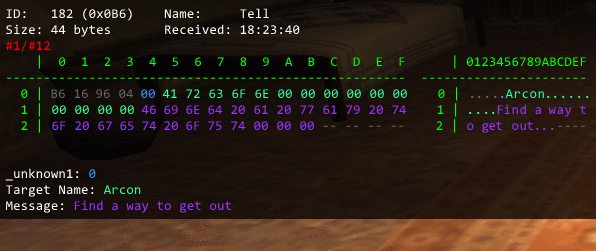

# Packetviewer

This addon has three main functions for working with packets.

## Packet introduction

*Disclaimer: Windower uses the terms "packet" and "chunk" somewhat interchangeably. Technically one UDP packet sent by the server can contain several chunks of smaller packets, but that is a technicality that is not relevant to us, as we rarely consider UDP packets. When we talk about packets here we mean packet chunks, the smallest units of communication between the server and the client. The big packet containing the smaller chunks is sometimes also referred to as the* UDP packet *to avoid confusion. For this document,* packet *will always refer to a packet chunk and when referring to the* UDP packet *we will call it that explicitly.*

### Structure

Each packet contains a four byte header which consists of the following:
* 9 bit - Packet ID
* 7 bit - Packet length / 4
* 16 bit - Sequence ID

Packets are usually referred to by their ID in hex form with three digits, i.e. it will be of the form `0xXXX`. For example, the packet carrying zone information every time you zone is packet `10`, which is `0xA` in hexadecimal form, and since we use three digits it will be `0x00A`. Since packet IDs use 9 bits, the highest packet ID is `0x1FF`, which is `511`.

The packet length in the packet needs to be multiplied by 4 to get the full packet length in bytes.

The sequence ID is the number of *UDP packets* sent to you by the server since zoning. Every time the server sends a *UDP packet* the sequence number will be increased. This is to ensure that packets arrive in-order. As mentioned above, it is largely irrelevant for our purposes.

As an example, if you see these first four bytes of a packet:
```
0E 1C 3F 19
```

It means that the ID is `0x00E` (the first byte and least significant bit of the next byte), it is 56 bytes long (`0x1C` is 28, shifted down by one bit is 14, then multiplied by 4 is 56) and the sequence ID is `0x193F`, which is 6463, i.e. this is the 6463th packet the server has sent.

Since this information is shared by all packets and irrelevant to the actual payload (except for the length, but the Windower API accomodates for that) it is usually ignored. In the display the entire header is greyed out.

### Data

Packets usually contain regular *C*/*C++* data types (`bool`, `int`, `unsigned short`, `float`, `char[N]` etc.). Strings are usually contained in fixed-size arrays and rarely arbitrarily sized, but it does happen for certain packets (usually containing longer strings like chat messages), in which case `char*` is used to denote that format.

Packets are usually packed loosely, i.e. they will often have meaningless padding bytes so that `int`s will align to a four byte boundary. As a rule of thumb, packet memory is not zeroed. That means that you will often find junk memory of previous packets in those padding bytes, which you may need to account for when analyzing packet data.

Often SE will use bit packing to compress more data into a single packet. For example the crafting skills of a character will contain three values in a two byte block:
* 5 bit - Rank
* 10 bit - Level
* 1 bit (boolean) - Capped or not

So if you have rank 3 (*Novice*), level 38 and are not currently capped, the values would be as follows:
```
 3    == 0b     00011
38    == 0b0000100110
false == 0b         0
```

Putting these values together results in the two bytes, using the little endian system (i.e. lower order bytes come first):
1. Inserting the rank (3):
   <pre>0b xxx<b>00011</b> xxxxxxxx</pre>
2. Inserting the level (38):
   <pre>0b <b>110</b>00011 x<b>0000100</b></pre>
3. Inserting the capped status (false):
   <pre>0b 11000011 <b>0</b>0000100</pre>

This corresponds to the hex representation `C3 04`.

## General addon usage

*PacketViewer* is mostly used through the command-line, although it has a few persistent settings that can be looked up in its settings file. The root command is `//packetviewer` or `//pv` for short. Almost all of the commands and options can be shortened to one letter. Common options include `incoming` and `outgoing`, which can always be shortened to `i` and `o` respectively.

Some features allow you to specify a list of packets. This is usually (but not always) done with space-separated IDs (both decimal and hexadecimal IDs are accepted). Unfortunately this is not always possible, in which case a pipe-separated option is used (most notably for the `track` command).

When a space-separated list of IDs is accepted you can always prepend a `not` to the list of IDs, in which case it will consider all *but* the provided IDs.

## Logging

This feature is used when trying to identify packets. The syntax is as follows:
```
//packetviewer log <console|chatlog|file> <incoming|outgoing|both> [not] id1 [id2 [...]]
```

When you want to figure out which packet is responsible for certain features of the FFXI client, you will use this function.

Let us consider the following example: we want to find out which packet carries chat messages sent by other people. To do this, we turn on logging:
```
//pv l c i
```

This is short for `packetviewer log console incoming`, i.e. we will log all incoming packets to the console. (Note that for this tutorial we will only log to the console, since it is the most convenient. Some people prefer logging to a file, but it should really only be done for long periods of packet parsing that need to be examined as a long list of packets, otherwise the console or chatlog is generally faster.)

Depending on where you are and if there are mobs and people around it might get very spammy very quickly:


You will see a lot of packets being sent despite no chat messages coming in, which makes sense, since the client has to be informed of a lot of things by the server. But this hardly helpful, so we need to filter them. To do that, we can exclude some packets, as described above. Simply note which packets are being spammed (the ID is shown in the log output). The most common packets that are spammed are `0x00D` and `0x00E`, which are carrying other PC and NPC information respectively, so we are going to filter those out. `0x028` is carrying information on any action that a player or NPC are performing, and they can get spammed quite a bit as well. Hence we are going to use this command:
```
//pv l c i not 0x00d 0x00e 0x028
```

In addition to filtering it is usually a good idea to move to some location that minimizes other types of packet spam like shouts/yells. That is why the Mog House is usually a good choice to do some packet research, unless you need to interact with certain PCs or NPCs.

Having entered the above command only packets that are not of those three IDs will be logged to the console, which makes it much less spammy. More packets can be filtered that way if they turn out to be interfering with finding the right packet. But make sure to not filter the right packet by accident. Since we are trying to capture chat packets we might accidentally block it if we are in a chat heavy area, like a common shout/yell zone, or if the LS/party is very active at the moment.

So now we have annoying packets filtered and we can continue looking for our chat packet. Now how are we going to get it? We can ask someone to say something in LS chat or send us a tell, but we can also force such a packet directly by sending ourselves a tell:
```
/t MyName Hey there, sexy!
```

After the short roundtrip delay from the server, we will see the tell come in, and the packet log should show a new packet coming in: `0x017`.

After repeating this process a few times we can be sure that this is the right packet. Huzzah!

## Examining

Once we have identified the packet we were looking for we can examine it in detail with the tracking feature. To track a specific packet (we will use the same example as above, the now-identified chat packet `0x017`) use the following command:
```
//packetviewer track <incoming|outgoing> ids [<incoming|outgoing> ids2 [...]]
```

For example, to track the packet we were interested before, we would do this:
```
//pv t i 0x017
```

A little text box will appear, with no info in it yet:


Now we do the same as above and send ourselves a tell:


Here we see the text box change and display the memory of the packet, in a hex table, as well as the information it was able to extract from it. This information is only shown for packets we know and which have already been described in the `Windower/addons/libs/packets/fields.lua` file. If the `0x017` packet had not been defined in there, this is what it would have looked like instead:


Sometimes this is not as easy as it should be. For example, say you want to track NPC update packets (incoming `0x00E`) for a mob you want to focus on. If that mob is surrounded by other mobs, you will receive update packets for all of them. To only track packets pertaining to the one mob *PacketViewer* supports a filtering method. You can specify any field from the `fields.lua` file and a value you expect it to be. To expand on the example, say you are currently in *Qufim Island* and you want to analyze one of the two *Seeker Bats* flying around near the *Jeuno* entrance. One of them has index 7, the other index 8. You can filter them like so:

```
//pv t i 0x00E Index 7
```

This will now only show packets whose `Index` field corresponds to the number 7. If you were at the cave exit and want to analyze packets of all the *Land Worms*, without any gigas or crabs interrupting, you can also filter by name:

```
//pv t i 0x00E Name "Land Worm"
```

Note that you need to use quotes to specify values containing spaces.

To then stop tracking incoming packets when you have enough to work with you would use `//pv t stop` or `//pv t s`. This is especially useful when there is a risk of the tracker display being overwritten with a new packet that matches the filtering criteria.

## Recording

Sometimes just tracking packets is not enough. If a new packet arrives, the text box will update, even though you may not have been finished analyzing it. For that case you can use the recording feature:
```
//packetviewer record [true|false]
```

It can be shortened to `//pv rec`. It will store all tracked  packets since recording was enabled and you can review them by using this command:
```
//packetviewer display <number>
```

Here `number` is the number of the recorded packet to display. Once the display box shows up (which looks identical to the tracking box, except for an indicator of which of the recorded packets is being displayed) you can hover your mouse over it and use the scroll wheel to scroll through the recorded packets. This makes it easy to examine and compare same packets that arrived at a different time.



## Scanning

The final major feature of *PacketViewer* is the scanning of incoming and/or outgoing packets for certain values:
```
//packetviewer scan <incoming|outgoing> <value>
```

For example, if you want to know which packets contain your personal ID (mine is `0xD35C`), you can do this:
```
//pv scan i 0xD35C
```

The following is some example output in the console window:


We could have used this feature in the above scenario to scan for the message we sent ourselves, which would have made it much quicker and easier to find, but would have ruined a perfectly good example scenario. Scanning should generally be used over logging if you know the exact value you are interested in. If that is not the case, you will likely need to resort to logging again and narrow the packet down from there.
